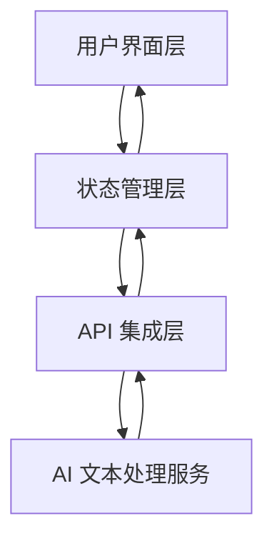
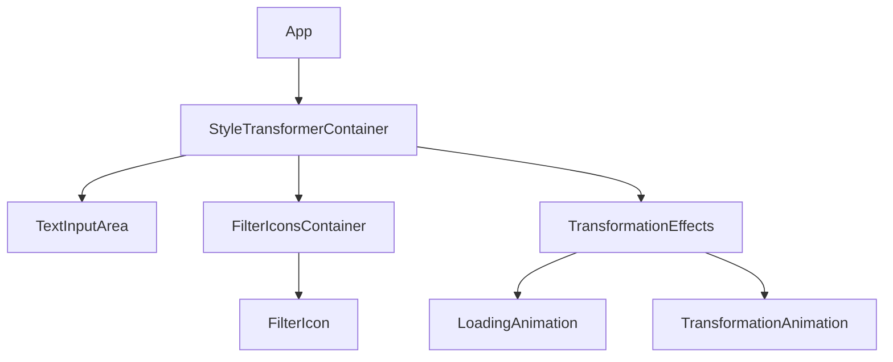
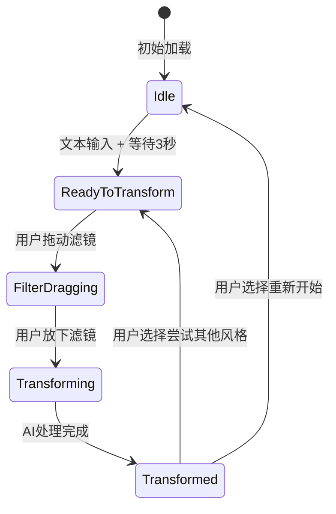

# Design Document

## Overview

Style Filter Transformer 是一个基于 AI 的文本风格转换应用，允许用户通过拖拽风格滤镜图标到文本容器上，将输入的文本转换为特定的写作风格。本设计文档详细描述了应用的架构、组件、数据流和用户界面设计。

## Architecture

应用采用现代前端架构，基于 Next.js 和 React 构建，并结合 AI 文本处理服务。

### 高层架构



### 技术栈

- **前端框架**：Next.js 15.2.0 + React 19.0.0
- **类型系统**：TypeScript
- **样式解决方案**：Tailwind CSS + CSS 变量
- **动画库**：Motion
- **状态管理**：React Context API + Hooks
- **API 通信**：Fetch API / Axios
- **AI 服务**：OpenAI API 或自定义 AI 文本处理服务

## Components and Interfaces

### 核心组件结构



### 主要组件详情

#### StyleTransformerContainer

负责整体布局和状态管理的容器组件。

```typescript
interface StyleTransformerContainerProps {
  children?: React.ReactNode;
}

// 应用状态类型
type TransformerState = 
  | 'idle'               // 初始状态
  | 'readyToTransform'   // 可转换态
  | 'filterDragging'     // 滤镜拖动中
  | 'transforming'       // 转换处理中
  | 'transformed';       // 转换完成
```

#### TextInputArea

文本输入和显示区域组件。

```typescript
interface TextInputAreaProps {
  value: string;
  onChange: (value: string) => void;
  state: TransformerState;
  onTextReady: () => void;
}
```

#### FilterIconsContainer

风格滤镜图标容器组件。

```typescript
interface FilterIconsContainerProps {
  filters: StyleFilter[];
  onFilterDragStart: (filter: StyleFilter) => void;
  onFilterDragEnd: (filter: StyleFilter) => void;
  state: TransformerState;
}

interface StyleFilter {
  id: string;
  name: string;
  icon: string | React.ReactNode;
  description?: string;
}
```

#### TransformationEffects

处理各种视觉效果和动画的组件。

```typescript
interface TransformationEffectsProps {
  state: TransformerState;
  selectedFilter: StyleFilter | null;
  onTransformationComplete: () => void;
}
```

### 拖拽接口

使用专门的拖放库 `dnd-kit` 实现滤镜图标的拖放功能，该库与 React 和 Next.js 完全兼容，提供更原生、更丝滑的拖放体验。

```typescript
// 使用 dnd-kit 的接口
import { useDraggable } from '@dnd-kit/core';
import { useDroppable } from '@dnd-kit/core';

// 可拖动滤镜组件
function DraggableFilter({ filter, ...props }) {
  const { attributes, listeners, setNodeRef, transform } = useDraggable({
    id: filter.id,
    data: filter
  });
  
  return (
    <div 
      ref={setNodeRef} 
      {...listeners} 
      {...attributes}
      style={{
        transform: transform ? `translate3d(${transform.x}px, ${transform.y}px, 0)` : undefined,
      }}
      {...props}
    >
      {/* 滤镜图标内容 */}
    </div>
  );
}

// 可放置目标组件
function DroppableTextArea({ onDrop, children }) {
  const { isOver, setNodeRef } = useDroppable({
    id: 'text-container',
    data: { accepts: 'filter' }
  });
  
  return (
    <div 
      ref={setNodeRef}
      className={`text-container ${isOver ? 'is-over' : ''}`}
    >
      {children}
    </div>
  );
}
```

## Data Models

### 核心数据模型

```typescript
// 风格滤镜定义
interface StyleFilter {
  id: string;
  name: string;
  icon: string | React.ReactNode;
  description?: string;
  apiParameter: string; // 用于API请求的参数
}

// 转换请求模型
interface TransformRequest {
  originalText: string;
  targetStyle: string; // 对应 StyleFilter.apiParameter
}

// 转换响应模型
interface TransformResponse {
  transformedText: string;
  status: 'success' | 'error';
  message?: string;
}

// 应用状态模型
interface AppState {
  originalText: string;
  transformedText: string;
  currentState: TransformerState;
  selectedFilter: StyleFilter | null;
  isProcessing: boolean;
  error: string | null;
}
```

### 预定义风格滤镜

基于 Figma 设计和写作风格关键词表，我们将实现以下风格滤镜：

1. **AP Style** - 美联社风格，适用于新闻报道
2. **X Style** - 社交媒体风格，简洁有力
3. **Inverted Pyramid** - 倒金字塔结构，核心信息优先
4. **Breaking News** - 突发新闻风格，紧急且直接
5. **Academic** - 学术风格，正式且有结构

每个滤镜将有对应的图标和视觉设计，与 Figma 设计一致。

## UI/UX Design

### 状态流转图



### 视觉设计

1. **整体布局**：
   - 居中的文本容器，固定宽度（500px）
   - 底部的滤镜图标区域，水平排列
   - 渐变背景，营造流动感

2. **文本容器设计**：
   - 虚线边框（初始状态）
   - 发光边框（可转换态）
   - 内部填充适当，确保文本可读性

3. **滤镜图标设计**：
   - 圆形或方形图标，带有代表性的视觉元素
   - 悬停和选中状态有明确的视觉反馈
   - 拖动状态有轻微的阴影和缩放效果

4. **动画效果**：
   - 边框发光动画（可转换态）
   - 滤镜融入动画（应用滤镜时）
   - 水平光幕扫描动画（转换过程）
   - 加载动画（处理中状态）
   - 文本显示动画（转换完成）

### 响应式设计

1. **桌面布局**：
   - 文本容器宽度固定为 500px
   - 滤镜图标水平排列

2. **平板布局**：
   - 文本容器宽度适应屏幕，最大 500px
   - 滤镜图标水平排列，可能需要滚动

3. **移动布局**：
   - 文本容器宽度适应屏幕，有适当边距
   - 滤镜图标可能改为网格布局或可滚动的水平列表

## API Integration

### AI 文本处理服务

我们将使用 OpenAI API 或自定义 AI 服务来处理文本风格转换。

#### API 端点

```
POST /api/transform
```

#### 请求体

```json
{
  "text": "原始文本内容",
  "style": "ap-style"
}
```

#### 响应体

```json
{
  "transformedText": "转换后的文本内容",
  "status": "success"
}
```

### 错误处理

API 调用可能遇到的错误：

1. **网络错误**：显示重试选项
2. **服务器错误**：显示友好的错误消息
3. **转换失败**：提供反馈并允许用户尝试其他风格或修改文本

## Error Handling

### 前端错误处理策略

1. **用户输入验证**：
   - 检查文本长度（过短或过长）
   - 防止空文本提交

2. **API 错误处理**：
   - 超时处理
   - 重试机制
   - 友好的错误消息

3. **UI 状态错误**：
   - 状态机确保状态转换的一致性
   - 回退机制，允许从错误状态恢复

### 错误消息设计

错误消息应该：
- 简明扼要
- 提供解决方案
- 视觉上不突兀
- 允许用户采取行动（重试、取消等）

## Testing Strategy

### 单元测试

使用 Jest 和 React Testing Library 测试各个组件：

1. **组件渲染测试**：
   - 确保组件在各种状态下正确渲染
   - 验证条件渲染逻辑

2. **状态管理测试**：
   - 验证状态转换逻辑
   - 测试用户交互导致的状态变化

3. **API 集成测试**：
   - 模拟 API 响应
   - 测试成功和失败场景

### 集成测试

1. **拖放功能测试**：
   - 验证拖放交互
   - 测试各种拖放场景

2. **动画效果测试**：
   - 验证动画触发条件
   - 测试动画完成回调

3. **响应式设计测试**：
   - 在不同屏幕尺寸下测试布局
   - 验证移动设备上的交互

### 用户体验测试

1. **可用性测试**：
   - 测试用户能否直观理解界面
   - 验证交互流程是否流畅

2. **性能测试**：
   - 测试动画性能
   - 验证在低性能设备上的表现

## Implementation Considerations

### 性能优化

1. **动画性能**：
   - 使用 CSS 变换和 opacity 进行动画
   - 避免频繁的 DOM 重排
   - 考虑使用 will-change 属性

2. **API 调用优化**：
   - 实现请求防抖
   - 考虑缓存相同文本和风格的转换结果

3. **资源加载**：
   - 优化图标和资源大小
   - 实现懒加载

### 可访问性

1. **键盘导航**：
   - 确保所有交互可通过键盘完成
   - 实现适当的焦点管理

2. **屏幕阅读器支持**：
   - 添加适当的 ARIA 属性
   - 确保动态内容变化被正确宣布

3. **颜色对比度**：
   - 确保文本和背景有足够的对比度
   - 提供高对比度模式

### 国际化

1. **文本翻译**：
   - 使用翻译键而非硬编码文本
   - 支持 RTL 语言布局

2. **日期和数字格式**：
   - 使用本地化库处理日期和数字

## Future Enhancements

1. **更多风格选项**：
   - 扩展风格滤镜库
   - 允许用户创建自定义风格

2. **历史记录**：
   - 保存用户的转换历史
   - 允许比较不同风格的结果

3. **社交分享**：
   - 添加分享转换结果的功能
   - 生成可分享的图片

4. **高级定制**：
   - 允许用户调整风格强度
   - 提供更细粒度的风格参数